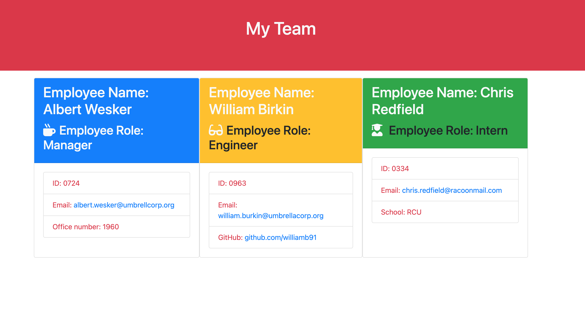

# Company-Team-Profile-Generator

Description

    With the use of command-line through Node.js, the Company-Team-Profile-Generator app allows the user to generate an HTML site for a software development team. The information provided by the use for each employee on a company team, will then generate an HTML webpage that displays data for each member. This application also uses npm jest to test each of the modules to insure peak functionality. The Company-Team-Profile-Generator app is very useful for quickly creating a functioning site with simple to use comman-lines. 

Table of Contents
Installation
Usage
Test
Questions

Installation: 

    First, the user must download (clone) the project repository from github and open it in Visual Studio Code on your machine. Make sure to install the inquirer dependency by typing npm i inquirer in the terminal. Finally, type node app.js to initiate the Company-Team-Profile-Generator app.

Usage:

    To begin, you must first type node index.js in Terminal to access the prompt to follow along with the generated questions display. Each question is displayed throught the terminal by the use of npm inquirer. You may enter any emplyee class as you choose for example, you may Intern first. If you choose to use manager forst, simply enter your Manager's emplee data. Then, choose Engineers, Contractor, or Interns to add to your team. Enter each of their details and decide if you want to add another role or if you are ready to build your team. Each employee has their name, role, ID, and email displayed on their card. In addition, the Manager has the office number, the Engineer has the github profile, and the Intern has the school name. When you are done answering all the questions, your input will be conveniently displayed on a brand new html page and saved in an output folder inside your local repository. Look at the screenshots to find out more. Good luck!

 

video link: https://watch.screencastify.com/v/teecNT1hB11ygxgTC5Bj

License
N/A

Test
Testing framework used: test : jest

Questions or Contributing?
If you would like to contribute to this project or if you have questions about the project, you can reach me via my GitHub or send me an email.

Github Profile: ronj2005
Email: ronj2005@gmail.com